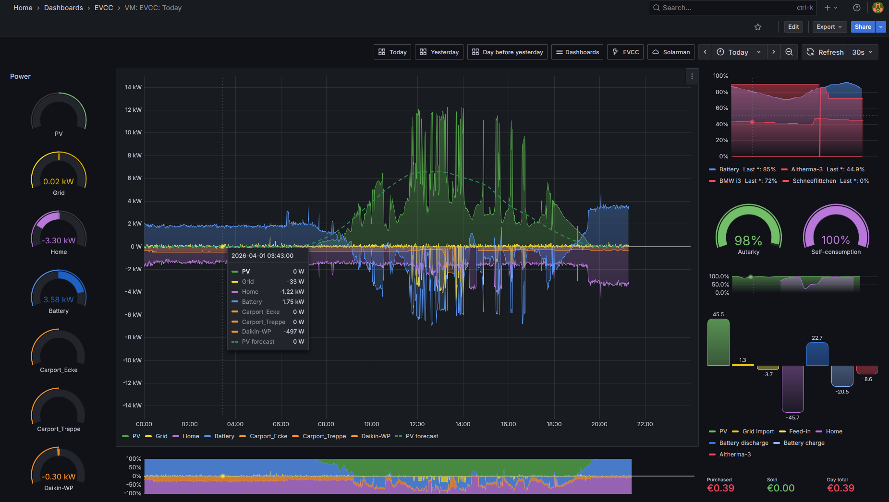

# EVCC Grafana Dashboards

> **Preview status:** This repository is still in preview. A first release is planned for the next few weeks.
> **Known issue:** Long-range PV rollups can still be wrong on some migrated datasets until the raw `pvPower` family has been repaired and re-imported. See [docs/influx-to-vm-migration.md](./docs/influx-to-vm-migration.md).

This repository provides a VictoriaMetrics-based dashboard set for [EVCC](https://evcc.io/). It is intended for users who want to move away from an InfluxDB-based EVCC dashboard setup without losing the familiar views for PV, grid, home consumption, battery, vehicles, charging points, energy flows, and costs.

It builds on the earlier InfluxDB-based EVCC dashboard work by Carsten:
[ha-puzzles/evcc-grafana-dashboards](https://github.com/ha-puzzles/evcc-grafana-dashboards).
Many thanks to Carsten for the excellent groundwork. This repository extends that foundation with a production-ready VictoriaMetrics path, migration guidance, rollups, localized dashboard variants, and simple Grafana deploy scripts.

Example dashboard:

## What this repository adds

- a complete VictoriaMetrics-based EVCC dashboard set
- generated dashboard translations based on an English source set
- deploy scripts for first-time imports and later updates
- a rollup script for daily long-range dashboard metrics
- documentation for InfluxDB to VictoriaMetrics migration
- end-user guides for VictoriaMetrics, Grafana, migration, and dashboard deployment

## What the dashboards cover

The dashboard set includes day, month, year, and all-time views.

- `Today` focuses on the current day: PV, grid, home, battery, charging points, energy flow, forecast, autarky, self-consumption, and costs.
- `Today - Details` goes deeper into phases, charging metrics, raw histories, and pricing details.
- `Today - Mobile` is a compact layout for smaller screens.
- `Month`, `Year`, and `All-time` provide longer-range energy, cost, battery, and vehicle analysis based on daily rollups.

Typical use cases:

- track PV production, self-consumption, and autarky
- compare grid import and feed-in over time
- analyze vehicles and charging points by energy, cost, and usage
- inspect battery charge, discharge, and SOC behavior
- visualize pricing trends, import cost, and load distribution
- migrate historic EVCC data from InfluxDB to VictoriaMetrics and continue operating there

## Getting started

For the full end-to-end path from EVCC + InfluxDB to EVCC + VictoriaMetrics + Grafana, continue here:

- [docs/README.md](./docs/README.md)
