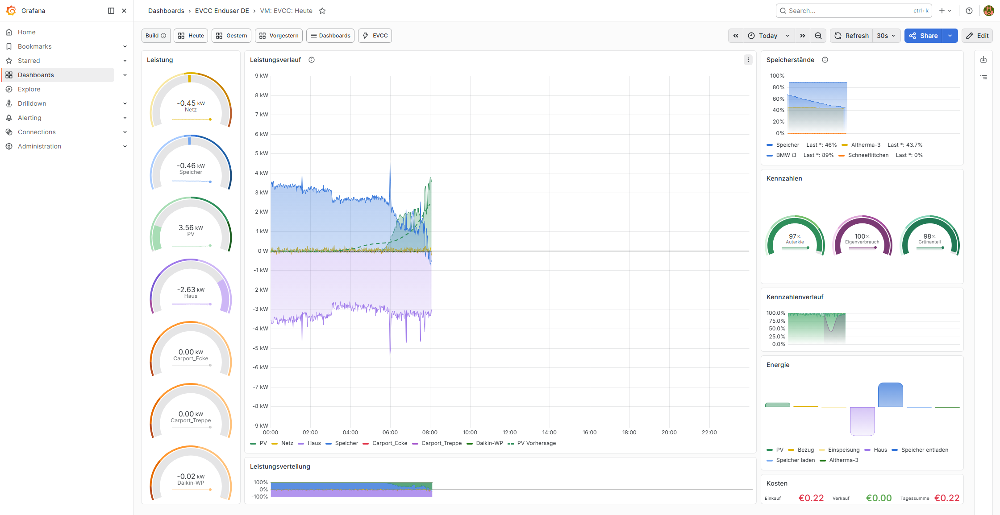

# EVCC Grafana Dashboards

This repository provides VictoriaMetrics-based dashboards for [EVCC](https://evcc.io/). It is intended both for new EVCC users starting with VictoriaMetrics and for users who want to move away from an InfluxDB-based EVCC dashboard setup without losing the familiar views for PV, grid, home consumption, battery, vehicles, charging points, energy flows, and costs.

It builds on the earlier InfluxDB-based EVCC dashboard work by Carsten:
[ha-puzzles/evcc-grafana-dashboards](https://github.com/ha-puzzles/evcc-grafana-dashboards).
Many thanks to Carsten for the excellent groundwork. This repository provides the VictoriaMetrics implementation path with migration tooling, daily rollups, localized dashboard variants, optional add-on analytics, and Grafana deploy scripts.

Example dashboard, automatically sourced from the current screenshot gallery:

More dashboard examples are available in the [screenshot gallery](./docs/screenshots/README_EN.md).

## What this repository adds

- a complete VictoriaMetrics-based EVCC dashboard collection
- generated dashboard translations based on the English source dashboards
- Grafana 13 TAB dashboards as the supported navigation model
- deploy scripts for first-time imports and later updates
- a rollup script for daily long-range dashboard metrics
- optional PV generation cost/LCOE analytics based on an investment file and a weekly helper
- PV source comparisons for yearly energy and specific yield (`kWh/kWp`)
- EVCC green share as a KPI in daily and long-range views
- optional historic energy imports, for example SMA PV yield and SMA energy balance files as EVCC-compatible daily values
- an optional [grid-control audit collector](./docs/en/grid-control-audit.md) for the Daily Details tab
- documentation for InfluxDB to VictoriaMetrics migration
- end-user guides for VictoriaMetrics, EVCC/Telegraf live ingest, Grafana, migration, and dashboard deployment
- curated release notes and screenshots for the recommended Grafana 13 TAB dashboards

## What the dashboards cover

The dashboards include day, month, year, and all-time views.

- `Today` focuses on the current day: PV, grid, home, battery, charging points, energy flow, forecast, autarky, self-consumption, green share, and costs.
- `Today - Details` goes deeper into phases, charging metrics, raw histories, pricing details, and optional grid-control/14a audit data.
- `Today - Mobile` is a compact layout for smaller screens.
- `Month`, `Year`, and `All-time` provide longer-range energy, cost, battery, vehicle, finance, and PV-source analysis based on daily rollups when the optional data is available.

Typical use cases:

- track PV production, self-consumption, and autarky
- compare grid import and feed-in over time
- analyze vehicles and charging points by energy, cost, and usage
- inspect battery charge, discharge, and SOC behavior
- visualize pricing trends, import cost, and load distribution
- compare PV sources by yearly energy, specific yield, and optional generation cost
- track green share, autarky, and self-consumption as separate KPIs
- audit optional grid-control/14a events when EVCC and the collector provide the required data
- migrate historic EVCC data from InfluxDB to VictoriaMetrics and continue operating there
- optionally fill historic years without EVCC data from compatible external daily imports

## Getting started

For installation, migration, live ingest, and dashboard deployment, continue here:

- [docs/en/README.md](./docs/README_EN.md)
- [release notes](./docs/en/release-notes.md)
