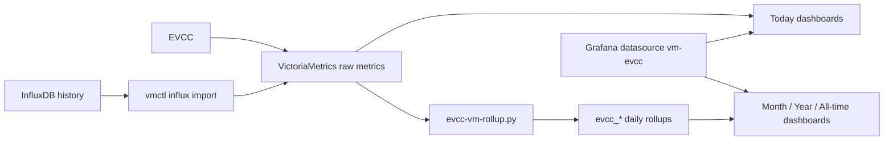

# EVCC with VictoriaMetrics and Grafana

This is the main entry point for users who want EVCC dashboards on VictoriaMetrics.

## Pick Your Path

### I already use EVCC with InfluxDB

Use this path when you want to keep your history and move the dashboard backend to VictoriaMetrics:

1. Install VictoriaMetrics.
2. Install or reuse Grafana.
3. Import historic InfluxDB raw data into VictoriaMetrics.
4. Build the daily `evcc_*` rollups.
5. Connect Grafana to VictoriaMetrics.
6. Deploy the dashboards.
7. Schedule the daily rollup refresh.

Start here:

- [Migrate from InfluxDB to VictoriaMetrics](./influx-to-vm-migration.md)
- [Migration checklist](./migration-checklist.md)

### I am setting up a new VictoriaMetrics stack

Install the runtime first, then deploy dashboards:

- VictoriaMetrics on Debian 13: [victoriametrics-install-debian-13.md](./victoriametrics-install-debian-13.md)
- VictoriaMetrics with Docker: [victoriametrics-install-docker.md](./victoriametrics-install-docker.md)
- Grafana on Debian 13: [grafana-install-debian-13.md](./grafana-install-debian-13.md)
- Grafana with Docker: [grafana-install-docker.md](./grafana-install-docker.md)
- Dashboard setup: [grafana-vm-dashboard-setup.md](./grafana-vm-dashboard-setup.md)

### I only want to update dashboards

Use the deployment guide directly:

- [Grafana dashboard setup](./grafana-vm-dashboard-setup.md)
- Quick deploy reference: [deployment-readme.md](./deployment-readme.md)
- Full deployer option reference: [vm-dashboard-install.md](./vm-dashboard-install.md)

## Data Model At A Glance



Key point: `Today`, `Today - Mobile`, and `Today - Details` use raw VictoriaMetrics data. `Month`, `Year`, and `All-time` use daily `evcc_*` rollups.

## Recommended Dashboard Set

The repository ships two deployable sets:

- `default`: classic row-based dashboards, works without Grafana tabs.
- `tabs`: recommended for Grafana 13.0.1 or newer because long dashboards are easier to navigate.

Set this in `vm-dashboard-install.env` when you want the tabbed set:

```env
DASHBOARD_SET=tabs
```

## Advanced Docs

Use these only when the normal migration path reports a problem or when you maintain the repository:

- Migration troubleshooting: [migration-troubleshooting.md](./migration-troubleshooting.md)
- Migration validation notes: [migration-validation-notes.md](./migration-validation-notes.md)
- Rollup design: [design/victoriametrics-rollup-design.md](./design/victoriametrics-rollup-design.md)
- Schema reference: [design/victoriametrics-schema-reference.md](./design/victoriametrics-schema-reference.md)
- Localization maintainer workflow: [design/localization-maintainer-workflow.md](./design/localization-maintainer-workflow.md)

## Release Preparation

- First end-user release checklist: [first-release-checklist.md](./first-release-checklist.md)
- Screenshot policy: [screenshots/README.md](./screenshots/README.md)