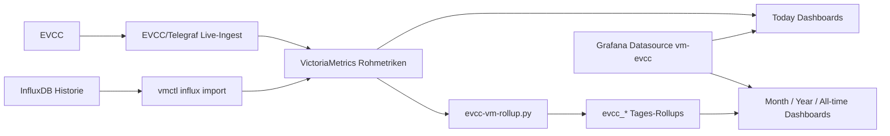

# EVCC mit VictoriaMetrics und Grafana

Dies ist der zentrale Einstieg fuer Nutzer, die EVCC-Dashboards mit VictoriaMetrics betreiben moechten.

Die englische Version dieser Seite ist hier: [README_EN.md](./README_EN.md).

Beginne mit der zentralen Uebersicht der Voraussetzungen: [system-requirements.md](./system-requirements.md).

## Welcher Pfad passt?

### Ich nutze EVCC bereits mit InfluxDB

Nutze diesen Pfad, wenn du deine Historie behalten und das Dashboard-Backend auf VictoriaMetrics umstellen moechtest:

1. VictoriaMetrics installieren.
2. EVCC/Telegraf Live-Ingest nach VictoriaMetrics einrichten.
3. Historische InfluxDB-Rohdaten nach VictoriaMetrics importieren.
4. Taegliche `evcc_*` Rollups erzeugen.
5. Grafana installieren oder eine bestehende Instanz weiterverwenden.
6. Grafana mit VictoriaMetrics verbinden.
7. Dashboards deployen.
8. Taegliche Rollup-Aktualisierung planen.

Starte hier:

- [EVCC/Telegraf Live-Ingest nach VictoriaMetrics](./evcc-telegraf-live-ingest.md)
- [Migration von InfluxDB nach VictoriaMetrics](./influx-to-vm-migration.md)
- [Migrations-Checkliste](./migration-checklist.md)

### Ich baue einen neuen VictoriaMetrics-Stack auf

Installiere zuerst die Laufzeitumgebung und danach die Dashboards:

- VictoriaMetrics auf Debian 13: [victoriametrics-install-debian-13.md](./victoriametrics-install-debian-13.md)
- VictoriaMetrics mit Docker: [victoriametrics-install-docker.md](./victoriametrics-install-docker.md)
- EVCC/Telegraf Live-Ingest: [evcc-telegraf-live-ingest.md](./evcc-telegraf-live-ingest.md)
- Grafana auf Debian 13: [grafana-install-debian-13.md](./grafana-install-debian-13.md)
- Grafana mit Docker: [grafana-install-docker.md](./grafana-install-docker.md)
- Dashboard-Setup: [grafana-vm-dashboard-setup.md](./grafana-vm-dashboard-setup.md)

### Ich moechte nur Dashboards aktualisieren

Nutze direkt die Deployment-Dokumentation:

- [Grafana Dashboard Setup](./grafana-vm-dashboard-setup.md)
- Kurzreferenz: [deployment-readme.md](./deployment-readme.md)
- Vollstaendige Deployer-Optionen: [vm-dashboard-install.md](./vm-dashboard-install.md)

## Datenmodell im Ueberblick

Wichtig: `Today`, `Today - Mobile` und `Today - Details` verwenden VictoriaMetrics-Rohdaten. `Month`, `Year` und `All-time` verwenden taegliche `evcc_*` Rollups.

## Unterstuetzte Dashboards

Die deploybaren Dashboards benoetigen Grafana 13.0.1 oder neuer und verwenden Grafana Tab Navigation fuer die langen Dashboard-Ansichten. Eine Dashboard-Set-Auswahl gibt es nicht mehr; die Deployer verwenden die feste Manifest-Dateiliste.

## Weiterfuehrende Dokumente

Diese Dokumente sind vor allem fuer Fehleranalyse, Betrieb und Maintainer relevant:

- Migration Troubleshooting: [migration-troubleshooting.md](./migration-troubleshooting.md)
- Migrations-Validierungsnotizen: [migration-validation-notes.md](./migration-validation-notes.md)
- Rollup-Design: [design/victoriametrics-rollup-design.md](./design/victoriametrics-rollup-design.md)
- Live-Ingest: [evcc-telegraf-live-ingest.md](./evcc-telegraf-live-ingest.md)
- Schema-Referenz: [design/victoriametrics-schema-reference.md](./design/victoriametrics-schema-reference.md)
- Lokalisierungs-Workflow: [design/localization-maintainer-workflow.md](./design/localization-maintainer-workflow.md)

## Release-Vorbereitung

- Erste Endnutzer-Release-Checkliste: [first-release-checklist.md](./first-release-checklist.md)
- Screenshot-Galerie: [screenshots/README.md](./screenshots/README.md)
