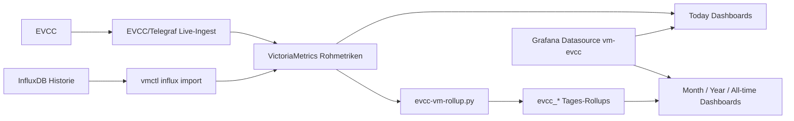

# EVCC mit VictoriaMetrics und Grafana

Dies ist der zentrale Einstieg fuer Nutzer, die EVCC-Dashboards mit VictoriaMetrics betreiben moechten.

Die englische Version dieser Seite ist hier: [README.md](./README_EN.md).

Beginne mit der zentralen Uebersicht der Voraussetzungen: [system-requirements.md](./de/system-requirements.md).

## Welcher Pfad passt?

### Ich nutze EVCC bereits mit InfluxDB

Nutze diesen Pfad, wenn du deine Historie behalten und das Dashboard-Backend auf VictoriaMetrics umstellen moechtest:

1. VictoriaMetrics installieren.
2. EVCC/Telegraf Live-Ingest vorbereiten, aber den VictoriaMetrics-Schreibpfad noch deaktiviert lassen.
3. Historische InfluxDB-Rohdaten nach VictoriaMetrics importieren.
4. Taegliche `evcc_*` Rollups fuer die importierte Historie erzeugen und die taegliche Rollup-Aktualisierung planen.
5. Kurz vor der Umschaltung einen finalen Delta-Import fuer die letzten InfluxDB-Daten ausfuehren und Rollups fuer neu abgeschlossene Tage aktualisieren.
6. Den VictoriaMetrics-Schreibpfad aktivieren und pruefen, dass aktuelle EVCC-Daten ankommen.
7. Danach Grafana installieren, verbinden und Dashboards deployen.

Starte hier:

- [VictoriaMetrics auf Debian 13](./de/victoriametrics-install-debian-13.md) oder [VictoriaMetrics mit Docker](./de/victoriametrics-install-docker.md)
- [EVCC/Telegraf Live-Ingest vorbereiten](./de/evcc-telegraf-live-ingest.md)
- [Migration von InfluxDB nach VictoriaMetrics](./de/influx-to-vm-migration.md)
- [Migrations-Checkliste](./de/migration-checklist.md)

### Ich baue einen neuen VictoriaMetrics-Stack auf

Installiere zuerst VictoriaMetrics. Danach richtest du EVCC/Telegraf ein und aktivierst den Schreibpfad sofort, weil es keine alte InfluxDB-Historie gibt. Sobald aktuelle Rohdaten in VictoriaMetrics ankommen, geht es weiter mit Grafana und dem Dashboard-Deployment.

- VictoriaMetrics auf Debian 13: [victoriametrics-install-debian-13.md](./de/victoriametrics-install-debian-13.md)
- VictoriaMetrics mit Docker: [victoriametrics-install-docker.md](./de/victoriametrics-install-docker.md)
- EVCC/Telegraf Live-Ingest: [evcc-telegraf-live-ingest.md](./de/evcc-telegraf-live-ingest.md)

### Ich moechte nur Dashboards aktualisieren

Nutze direkt die Deployment-Dokumentation:

- [Grafana Dashboard Setup](./de/grafana-vm-dashboard-setup.md)
- Kurzreferenz: [deployment-readme.md](./de/deployment-readme.md)
- Vollstaendige Deployer-Optionen: [vm-dashboard-install.md](./de/vm-dashboard-install.md)

## Datenmodell im Ueberblick

Wichtig: `Today`, `Today - Mobile` und `Today - Details` verwenden VictoriaMetrics-Rohdaten. `Month`, `Year` und `All-time` verwenden taegliche `evcc_*` Rollups.

## Unterstuetzte Dashboards

Die deploybaren Dashboards benoetigen Grafana 13.0.1 oder neuer und verwenden Grafana Tab Navigation fuer die langen Dashboard-Ansichten. Eine Dashboard-Set-Auswahl gibt es nicht mehr; die Deployer verwenden die feste Manifest-Dateiliste.

## Weiterfuehrende Dokumente

Diese Dokumente sind vor allem fuer Fehleranalyse und Betrieb relevant:

- Migration Troubleshooting: [migration-troubleshooting.md](./de/migration-troubleshooting.md)
- Migrations-Validierungsnotizen: [migration-validation-notes.md](./de/migration-validation-notes.md)
- Rollup-Design: [design/victoriametrics-rollup-design.md](./de/design/victoriametrics-rollup-design.md)
- Live-Ingest: [evcc-telegraf-live-ingest.md](./de/evcc-telegraf-live-ingest.md)
- Schema-Referenz: [design/victoriametrics-schema-reference.md](./de/design/victoriametrics-schema-reference.md)
- Entscheidung Setup-/Filter-Statuspanel: [design/setup-filter-status-panel-decision.md](./de/design/setup-filter-status-panel-decision.md)

## Screenshots

- Screenshot-Galerie: [screenshots/README.md](./screenshots/README.md)
