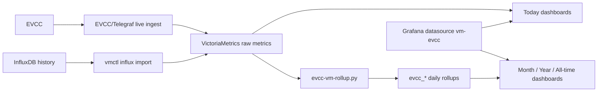

# EVCC with VictoriaMetrics and Grafana

This is the main entry point for users who want EVCC dashboards on VictoriaMetrics.

Start with the central requirements overview: [system-requirements.md](./system-requirements_EN.md).

## Pick Your Path

### I already use EVCC with InfluxDB

Use this path when you want to keep your history and move the dashboard backend to VictoriaMetrics:

1. Install VictoriaMetrics.
2. Import historic InfluxDB raw data into VictoriaMetrics.
3. Build the daily `evcc_*` rollups.
4. Schedule the daily rollup refresh.
5. Configure EVCC/Telegraf live ingest to VictoriaMetrics.
6. From the live ingest guide, install/connect Grafana and deploy the dashboards.

Start here:

- [Migrate from InfluxDB to VictoriaMetrics](./influx-to-vm-migration_EN.md)
- [Migration checklist](./migration-checklist_EN.md)
- [EVCC/Telegraf live ingest to VictoriaMetrics](./evcc-telegraf-live-ingest_EN.md)

### I am setting up a new VictoriaMetrics stack

Install VictoriaMetrics first. At the end of the VictoriaMetrics guide, continue with EVCC/Telegraf; at the end of the EVCC/Telegraf guide, continue with Grafana and dashboard deployment.

- VictoriaMetrics on Debian 13: [victoriametrics-install-debian-13.md](./victoriametrics-install-debian-13_EN.md)
- VictoriaMetrics with Docker: [victoriametrics-install-docker.md](./victoriametrics-install-docker_EN.md)
- EVCC/Telegraf live ingest: [evcc-telegraf-live-ingest.md](./evcc-telegraf-live-ingest_EN.md)

### I only want to update dashboards

Use the deployment guide directly:

- [Grafana dashboard setup](./grafana-vm-dashboard-setup_EN.md)
- Quick deploy reference: [deployment-readme.md](./deployment-readme_EN.md)
- Full deployer option reference: [vm-dashboard-install.md](./vm-dashboard-install_EN.md)

## Data Model At A Glance

Key point: `Today`, `Today - Mobile`, and `Today - Details` use raw VictoriaMetrics data. `Month`, `Year`, and `All-time` use daily `evcc_*` rollups.

## Supported Dashboards

The deployable dashboards require Grafana 13.0.1 or newer and use Grafana tab navigation for the long dashboard views. Dashboard set selection is no longer supported; the deployers use the fixed manifest file list.

## Advanced Docs

Use these when the normal migration path reports a problem or when you need operational background:

- Migration troubleshooting: [migration-troubleshooting.md](./migration-troubleshooting_EN.md)
- Migration validation notes: [migration-validation-notes.md](./migration-validation-notes_EN.md)
- Rollup design: [design/victoriametrics-rollup-design.md](./design/victoriametrics-rollup-design_EN.md)
- Live ingest: [evcc-telegraf-live-ingest.md](./evcc-telegraf-live-ingest_EN.md)
- Schema reference: [design/victoriametrics-schema-reference.md](./design/victoriametrics-schema-reference_EN.md)
## Screenshots

- Screenshot gallery: [screenshots/README.md](./screenshots/README_EN.md)
