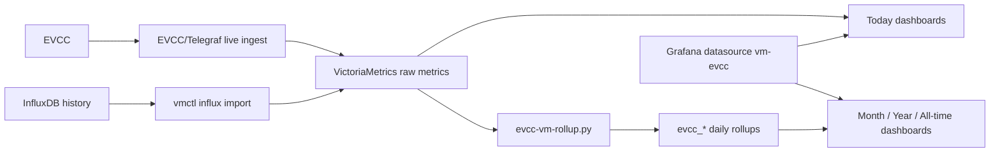

# EVCC with VictoriaMetrics and Grafana

This is the main entry point for users who want EVCC dashboards on VictoriaMetrics.

Start with the central requirements overview: [system-requirements.md](./en/system-requirements.md).

## Pick Your Path

### I already use EVCC with InfluxDB

Use this path when you want to keep your history and move the dashboard backend to VictoriaMetrics:

1. Install VictoriaMetrics.
2. Prepare EVCC/Telegraf live ingest, but keep the VictoriaMetrics write path disabled for now.
3. Import historic InfluxDB raw data into VictoriaMetrics.
4. Build the daily `evcc_*` rollups for the imported history and schedule the daily rollup refresh.
5. Shortly before cutover, run a final delta import for the last InfluxDB data and refresh rollups for newly completed days.
6. Enable the VictoriaMetrics write path and verify that current EVCC data arrives.
7. Then install/connect Grafana and deploy the dashboards.

Start here:

- [VictoriaMetrics on Debian 13](./en/victoriametrics-install-debian-13.md) or [VictoriaMetrics with Docker](./en/victoriametrics-install-docker.md)
- [Prepare EVCC/Telegraf live ingest](./en/evcc-telegraf-live-ingest.md)
- [Migrate from InfluxDB to VictoriaMetrics](./en/influx-to-vm-migration.md)
- [Migration checklist](./en/migration-checklist.md)

### I am setting up a new VictoriaMetrics stack

Install VictoriaMetrics first. Then configure EVCC/Telegraf and enable the write path immediately, because there is no old InfluxDB history. Once current raw data arrives in VictoriaMetrics, continue with Grafana and dashboard deployment.

- VictoriaMetrics on Debian 13: [victoriametrics-install-debian-13.md](./en/victoriametrics-install-debian-13.md)
- VictoriaMetrics with Docker: [victoriametrics-install-docker.md](./en/victoriametrics-install-docker.md)
- EVCC/Telegraf live ingest: [evcc-telegraf-live-ingest.md](./en/evcc-telegraf-live-ingest.md)

### I only want to update dashboards

Use the deployment guide directly:

- [Grafana dashboard setup](./en/grafana-vm-dashboard-setup.md)
- Quick deploy reference: [deployment-readme.md](./en/deployment-readme.md)
- Full deployer option reference: [vm-dashboard-install.md](./en/vm-dashboard-install.md)

## Data Model At A Glance

Key point: `Today`, `Today - Mobile`, and `Today - Details` use raw VictoriaMetrics data. `Month`, `Year`, and `All-time` use daily `evcc_*` rollups.

## Supported Dashboards

The deployable dashboards require Grafana 13.0.1 or newer and use Grafana tab navigation for the long dashboard views. Dashboard set selection is no longer supported; the deployers use the fixed manifest file list.

## Advanced Docs

Use these when the normal migration path reports a problem or when you need operational background:

- Migration troubleshooting: [migration-troubleshooting.md](./en/migration-troubleshooting.md)
- Migration validation notes: [migration-validation-notes.md](./en/migration-validation-notes.md)
- Rollup design: [design/victoriametrics-rollup-design.md](./en/design/victoriametrics-rollup-design.md)
- Live ingest: [evcc-telegraf-live-ingest.md](./en/evcc-telegraf-live-ingest.md)
- Schema reference: [design/victoriametrics-schema-reference.md](./en/design/victoriametrics-schema-reference.md)
- Dashboard color semantics: [design/dashboard-color-semantics.md](./en/design/dashboard-color-semantics.md)
- Investment costs for effective electricity price: [investment-costs.md](./en/investment-costs.md)
- Optional per-source SMA PV data import: [sma-pv-import.md](./en/sma-pv-import.md)
- Import SMA energy balance as historic EVCC rollups: [sma-energy-balance-import.md](./en/sma-energy-balance-import.md)
- Setup/filter status panel decision: [design/setup-filter-status-panel-decision.md](./en/design/setup-filter-status-panel-decision.md)

## Screenshots

- Screenshot gallery: [screenshots/README.md](./screenshots/README_EN.md)
