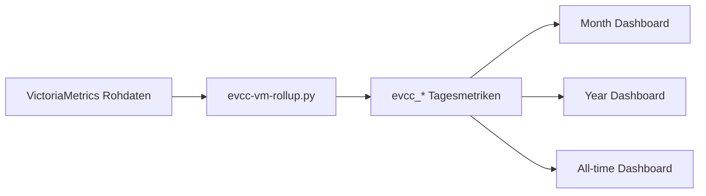

# VictoriaMetrics Rollup Design

Englische Originalfassung: [victoriametrics-rollup-design_EN.md](./victoriametrics-rollup-design_EN.md).

Dieses Dokument beschreibt das Rollup-Modell fuer EVCC-Daten in VictoriaMetrics.

## Ziel

Langzeit-Dashboards sollen nicht fuer jeden Aufruf grosse Rohdatenbereiche aggregieren muessen. Stattdessen erzeugt `evcc-vm-rollup.py` taegliche Metriken mit Prefix `evcc_*`.

## Grundprinzip

- Rohdaten bleiben unveraendert erhalten.
- Tages-Rollups werden aus Rohdaten berechnet.
- Langzeit-Dashboards lesen Rollup-Metriken.
- Wiederholungslaufe muessen idempotent sein.

## Datenfluss

## Betriebsregeln

- Historische Erstberechnung fuer den kompletten Migrationszeitraum ausfuehren.
- Taegliche Aktualisierung fuer neue oder korrigierte Tage planen.
- Bei Wiederholung `--replace-range` verwenden.
- Rollup-Laeufe protokollieren und Fehler sichtbar machen.

## Validierung

- Datenpraesenz pruefen.
- Import-Abdeckung gegen InfluxDB vergleichen.
- Energie- und Kostenwerte gegen externe Referenzen plausibilisieren.
- Query-Readback und Render-E2E fuer Dashboards ausfuehren.

## Offene Qualitaetspunkte

- Laufzeit weiter beobachten.
- Reset-, Spike- und Gap-Zaehler deutlicher ausgeben.
- parallele Scheduler-Laeufe verhindern.
- sichtbares Dashboard-Health-Panel fuer Rollup-Status ergaenzen.

Die englische Fassung enthaelt die ausfuehrlicheren historischen Entwurfsdetails.