# Screenshots

Englische Version: [English README](./README_EN.md).

Dieser Ordner enthaelt die kuratierte Screenshot-Serie fuer die aktuelle EVCC/VictoriaMetrics-Dashboard-Version. Die PNG-Dateien liegen direkt in diesem Verzeichnis; das fruehere Unterverzeichnis `tabs/` wird nicht mehr verwendet.

## Regeln

- Alte Screenshot-Dateien vor einer Regenerierung loeschen.
- Screenshots nicht still in-place ersetzen.
- Screenshots sollen die relevante Navigation zeigen, insbesondere Tabs, wenn ein Dashboard Tabs verwendet.
- Fuer Release-Dokumentation bevorzugt die Grafana-13-TAB-Dashboards verwenden.
- Dateinamen stabil, klein geschrieben und beschreibend halten.

## Today

| Screenshot | Beschreibung |
| --- | --- |
|  | `VM: EVCC: Today` als Uebersicht fuer den aktuellen Tag. |
| 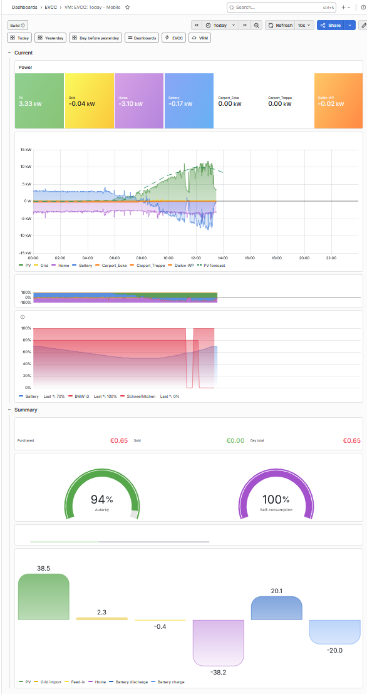 | Kompakte mobile Today-Ansicht. |

## Today - Details Tabs

| Screenshot | Beschreibung |
| --- | --- |
| 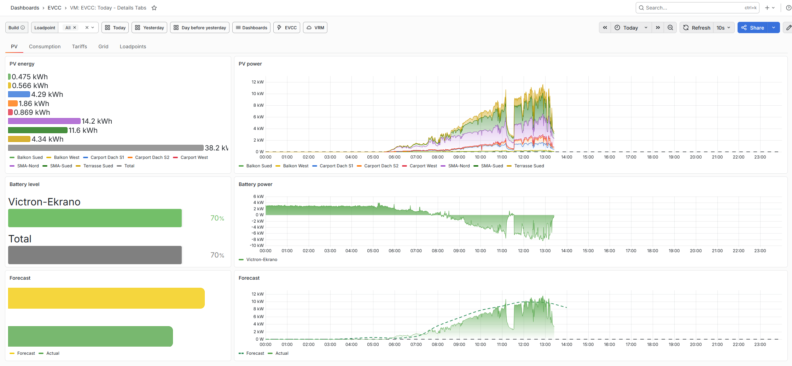 | PV-Tab mit PV-Energie, PV-Leistung, Batterie und Forecast. |
| 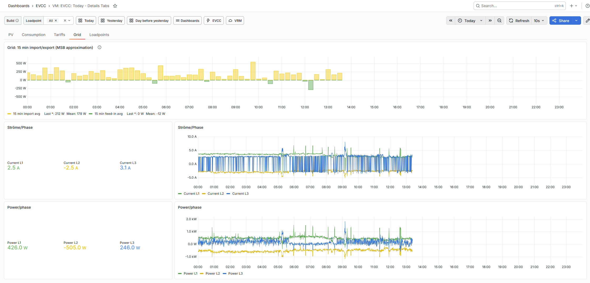 | Netz-Tab mit Grid-/Netzsicht und Einspeise-/Bezugsverlauf. |
| 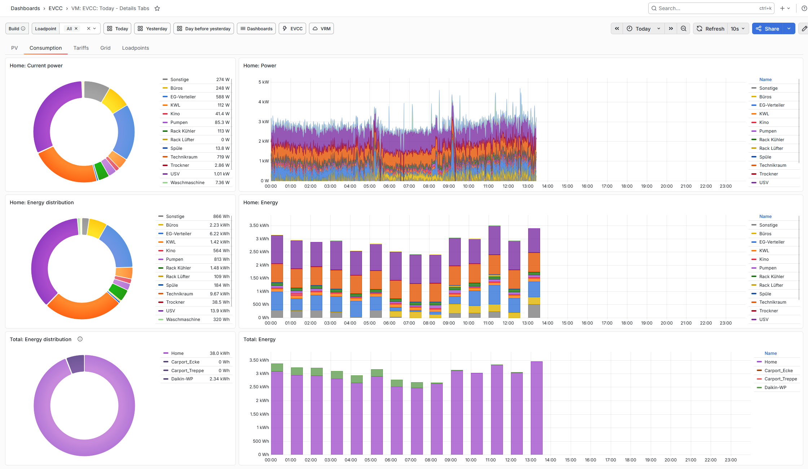 | Verbrauch-Tab mit Hausverbrauch und relevanten Verbrauchern. |
| 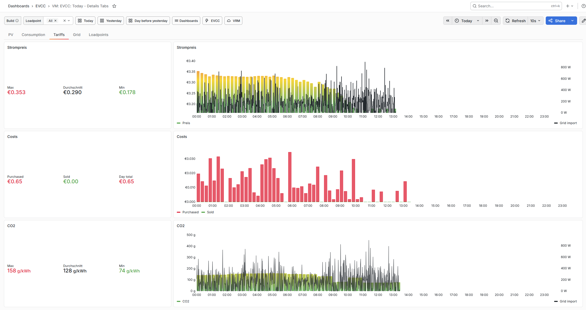 | Tarife-Tab mit Preis- und Kostenansichten. |
| 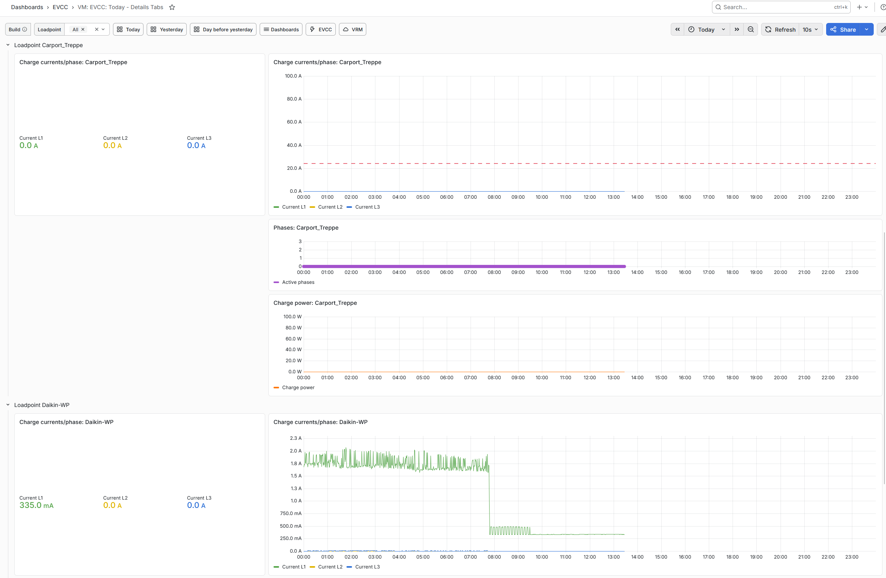 | Ladepunkte-Tab mit Ladepunkt- und Fahrzeugdaten. |

## Month Tabs

| Screenshot | Beschreibung |
| --- | --- |
| 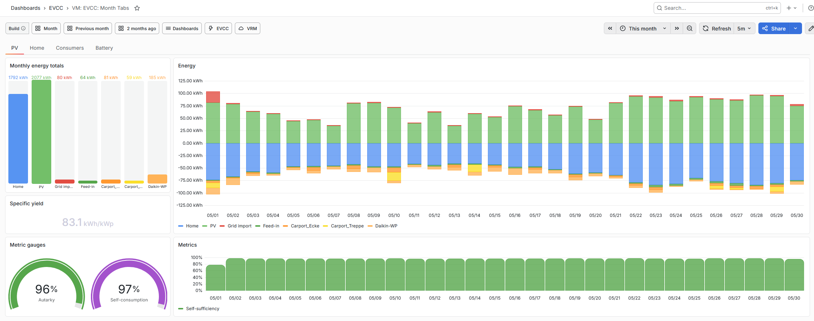 | Monatsansicht fuer PV-Erzeugung und PV-Auswertung. |
| 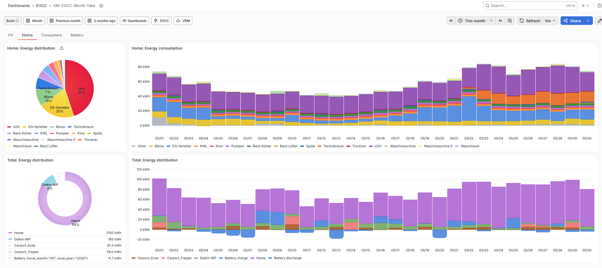 | Monatsansicht fuer Haus, Netzbezug und Eigenverbrauch. |
| 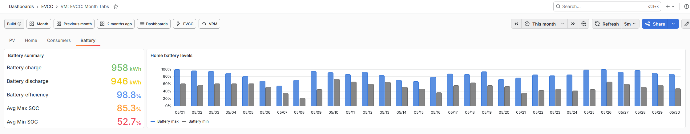 | Monatsansicht fuer Batterie, SOC und Speicherfluesse. |
| 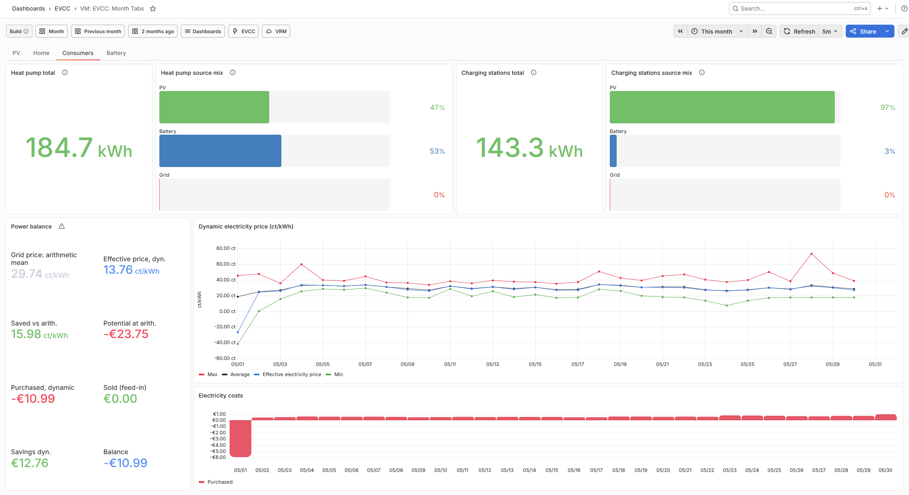 | Monatsansicht fuer Verbraucher und Lastverteilung. |

## Year Tabs

| Screenshot | Beschreibung |
| --- | --- |
| 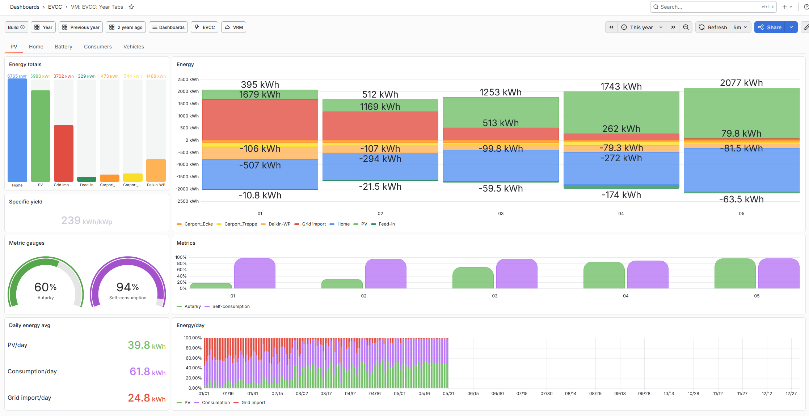 | Jahresansicht fuer PV-Erzeugung und PV-Vergleich. |
| 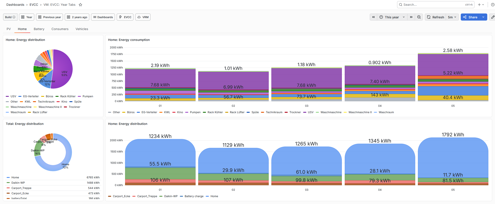 | Jahresansicht fuer Haus, Netz und Autarkie. |
| 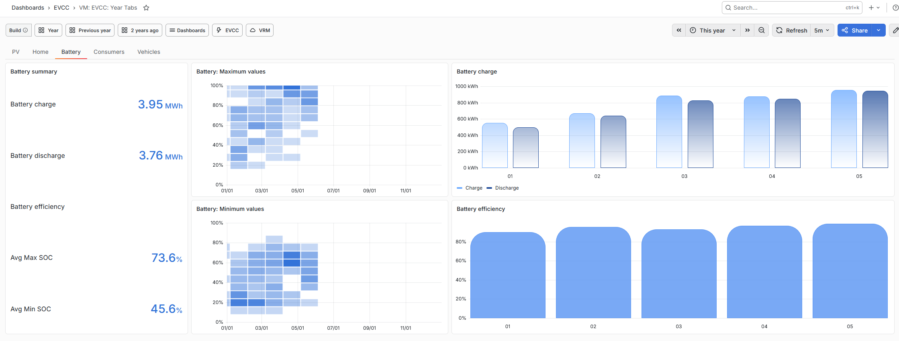 | Jahresansicht fuer Batterie- und Speicherkennzahlen. |
| 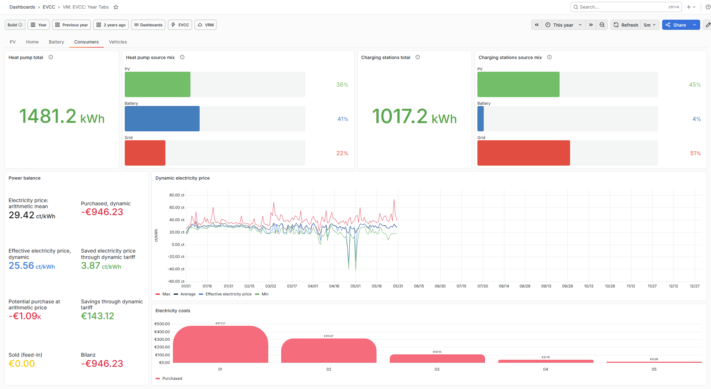 | Jahresansicht fuer Verbraucher. |
| 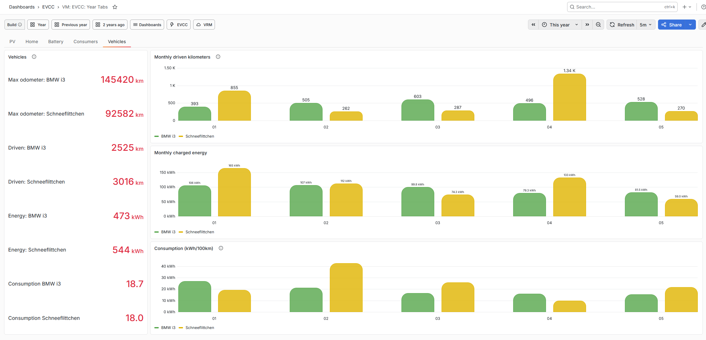 | Jahresansicht fuer Fahrzeuge und Ladeenergie. |

## All-Time Tabs

| Screenshot | Beschreibung |
| --- | --- |
| 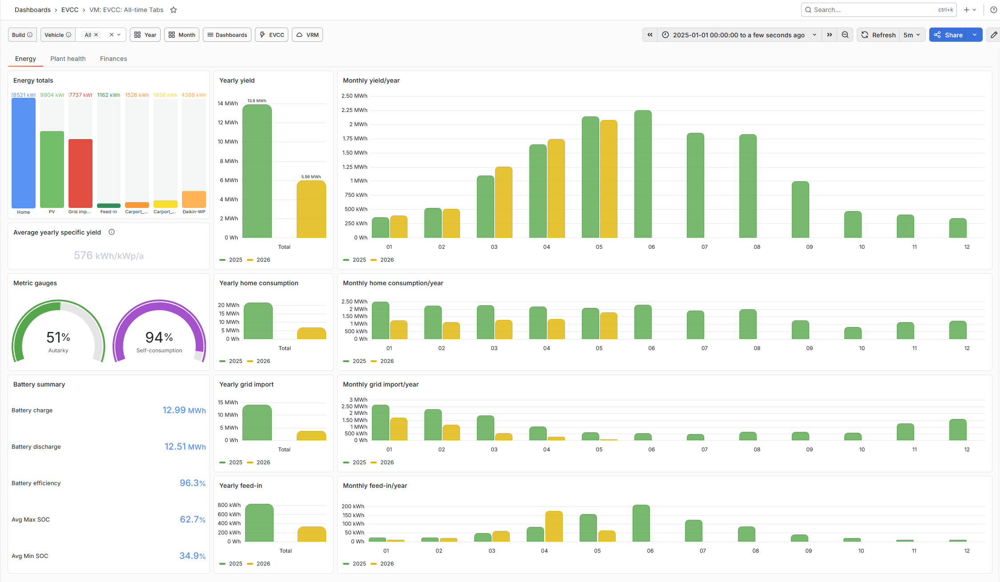 | All-Time-Energieuebersicht ueber die gesamte Historie. |
| 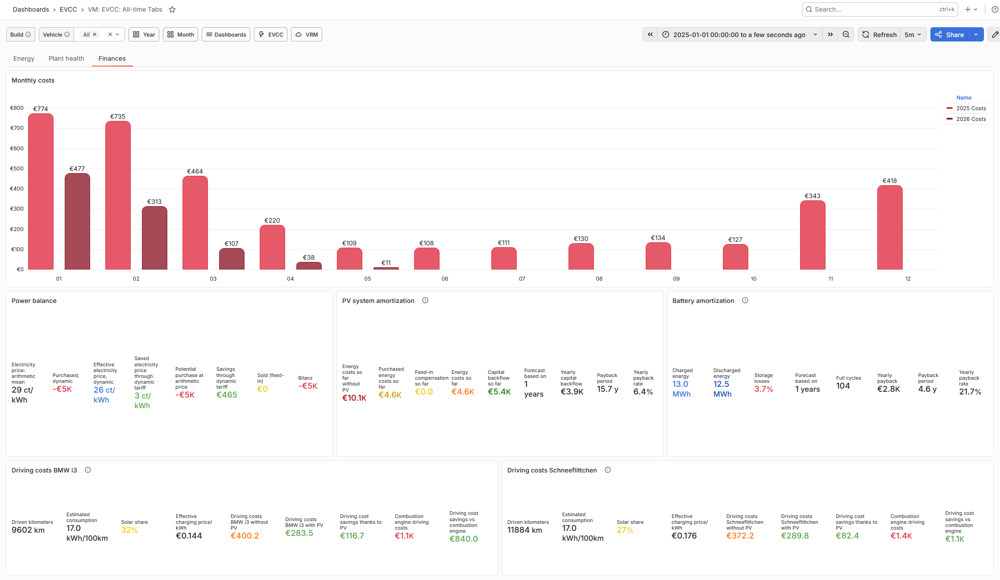 | All-Time-Finanzansicht mit Kosten- und Ersparniskennzahlen. |
| 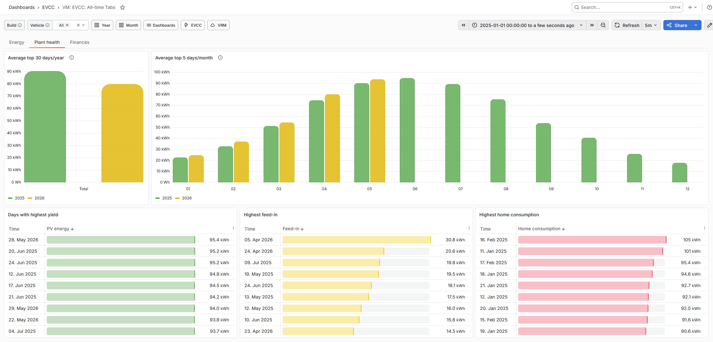 | All-Time-Anlagengesundheit mit Langzeitindikatoren. |
