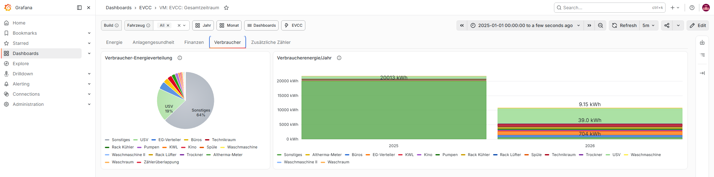
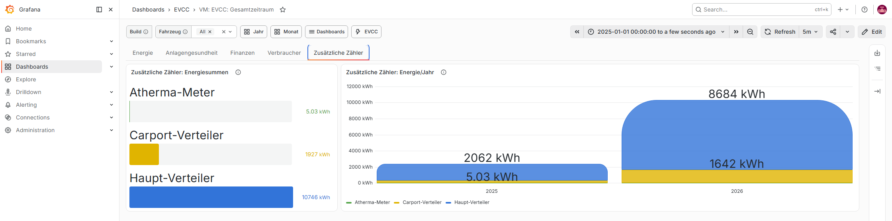
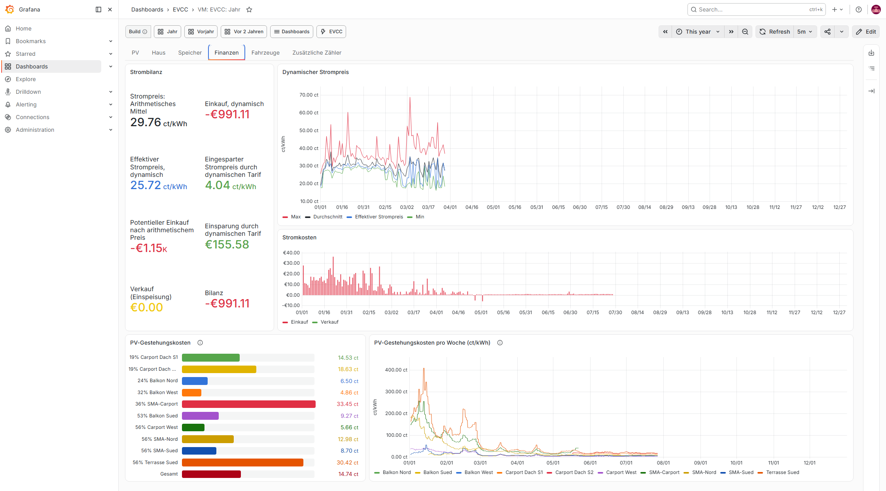
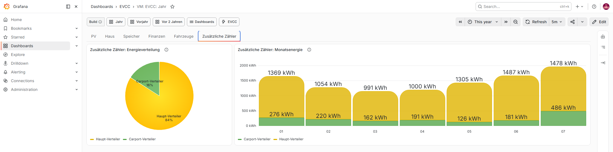
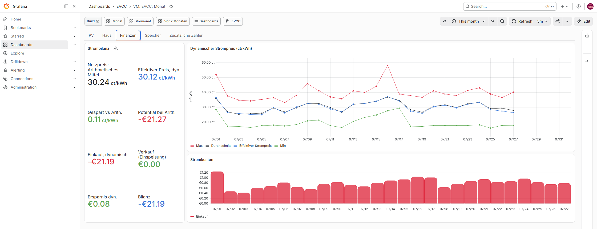
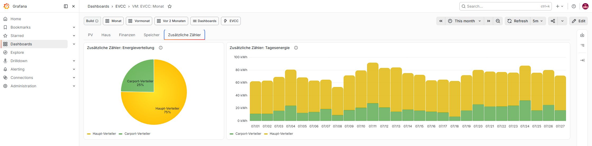
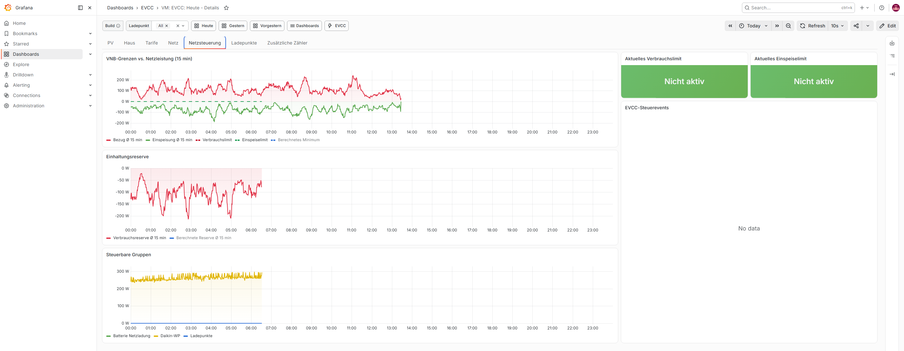
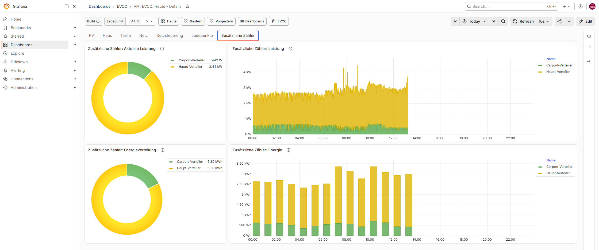

# Screenshots

Englische Version: [English README](./README_EN.md).

Dieser Ordner zeigt Beispiele der aktuellen EVCC/VictoriaMetrics-Dashboards. Die PNG-Dateien koennen aus einer lokalen Grafana-Instanz mit `npm run screenshots:docs:de` neu erzeugt werden.

## All-Time

### All-Time Energie

All-Time-Energieuebersicht ueber die gesamte Historie.

### All-Time Finanzen

All-Time-Finanzansicht mit Kosten- und Ersparniskennzahlen.

### All-Time Anlagengesundheit

All-Time-Anlagengesundheit mit Langzeitindikatoren.

### All-Time Verbraucher

All-Time-Verbraucherenergie mit historischen EXT- und aktuellen Consumer-Reihen.

### All-Time Zusätzliche Zähler

All-Time-Ansicht der fachlich getrennten zusätzlichen Kontroll- und Summenzähler.

## Year

### Year PV

Jahresansicht fuer PV-Erzeugung und PV-Vergleich.

### Year Haus

Jahresansicht fuer Haus, Netz und Autarkie.

### Year Speicher

Jahresansicht fuer Batterie- und Speicherkennzahlen.

### Year Finanzen

Jahresansicht fuer Finanzen, Stromkosten und PV-Gestehungskosten.

### Year Fahrzeuge

Jahresansicht fuer Fahrzeuge und Ladeenergie.

### Year Zusätzliche Zähler

Jahresansicht der zusätzlichen Zähler getrennt von den Hausverbrauchern.

## Month

### Month PV

Monatsansicht fuer PV-Erzeugung und PV-Auswertung.

### Month Haus

Monatsansicht fuer Haus, Netzbezug und Eigenverbrauch.

### Month Speicher

Monatsansicht fuer Batterie, SOC und Speicherfluesse.

### Month Finanzen

Monatsansicht fuer Finanzen, Strompreise und Stromkosten.

### Month Zusätzliche Zähler

Monatsansicht der zusätzlichen Kontroll- und Summenzähler.

## Today - Details

### Today Details PV

PV-Tab mit PV-Energie, PV-Leistung, Batterie und Forecast.

### Today Details Netz

Netz-Tab mit Grid-/Netzsicht und Einspeise-/Bezugsverlauf.

### Today Details Netzsteuerung

Netzsteuerungs-Tab mit VNB-Grenzen, Einhaltungsreserven, steuerbaren Gruppen und EVCC-Steuerevents.

### Today Details Haus

Haus-Tab mit Hausverbrauch und relevanten Verbrauchern.

### Today Details Tarife

Tarife-Tab mit Preis- und Kostenansichten.

### Today Details Ladepunkte

Ladepunkte-Tab mit Ladepunkt- und Fahrzeugdaten.

### Today Details Zusätzliche Zähler

Aktuelle Leistung und Tagesenergie der zusätzlichen Zähler ohne doppelte historische Consumer.

## Today

### Today Uebersicht

`VM: EVCC: Today` als Uebersicht fuer den aktuellen Tag.

## Today Mobile

### Today Mobile Uebersicht

Kompakte mobile Today-Ansicht.
